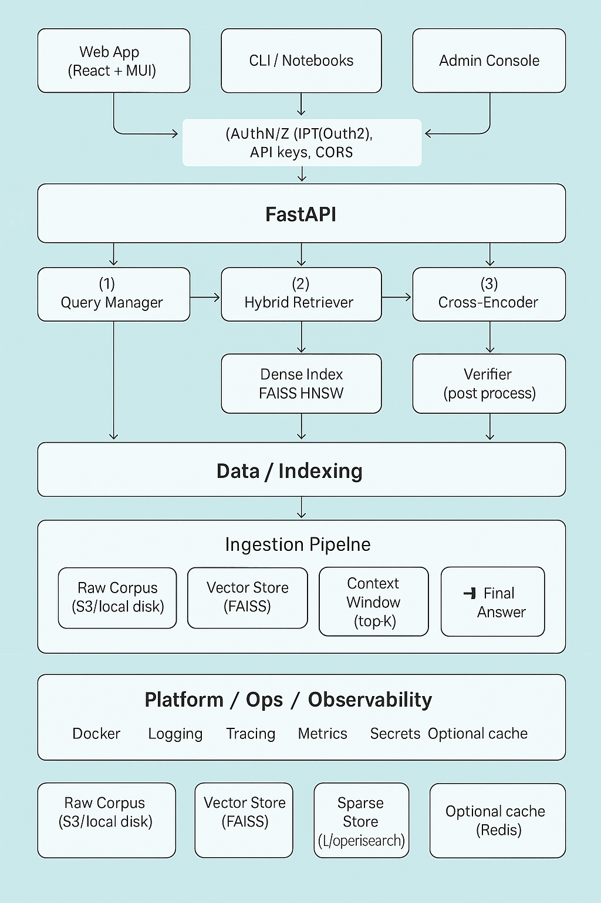

# 🧠 PersonaRAG
> LLM-augmented Information Retrieval (IR) & Question Answering over a personal knowledge corpus (resume, projects, docs).
Licensed Under(./LICENSE)

PersonaRAG retrieves evidence from a curated personal corpus and generates grounded answers with inline citations. The system uses **hybrid retrieval (Dense + BM25)**, **cross-encoder reranking**, a **grounded LLM generator**, and a **Verifier** that filters unsupported sentences.

---

## ✨ Features
- **Hybrid Retrieval**: Dense embeddings (E5) + BM25 fusion for high recall.
- **Cross-Encoder Reranking**: `BAAI/bge-reranker-base` for precise ordering.
- **Grounded Generation**: LLM answers strictly from retrieved context.
- **Verifier**: Sentence-level support check to reduce hallucinations.
- **FastAPI API**: `/search` and `/qa` endpoints.
- **Pluggable Stack**: OpenAI / Llama 3 / Mistral; FAISS / Pyserini or OpenSearch.
- **Dockerized**: Reproducible local or server deployment.

---

## 🧩 Tech Stack
- **Frontend**: React + Vite + MUI v6 (optional UI)
- **API**: FastAPI (Python 3.11), Pydantic
- **Dense**: Sentence-Transformers (`intfloat/e5-base-v2`) + **FAISS** (HNSW)
- **Sparse**: **Pyserini** (Lucene) or **OpenSearch** (BM25)
- **Rerank**: `BAAI/bge-reranker-base` (cross-encoder)
- **Generation**: OpenAI GPT-4o / Llama 3.1 Instruct / Mistral
- **Verifier**: Embedding similarity (E5/BGE)
- **Ops**: Docker, Makefile, Prometheus, OpenTelemetry (optional)

---

